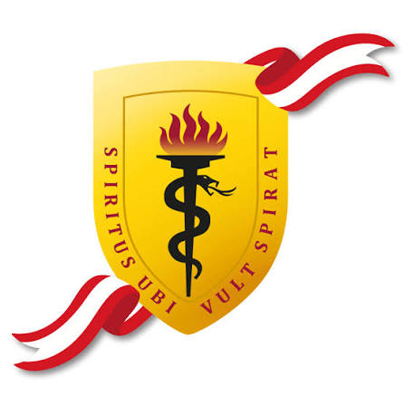
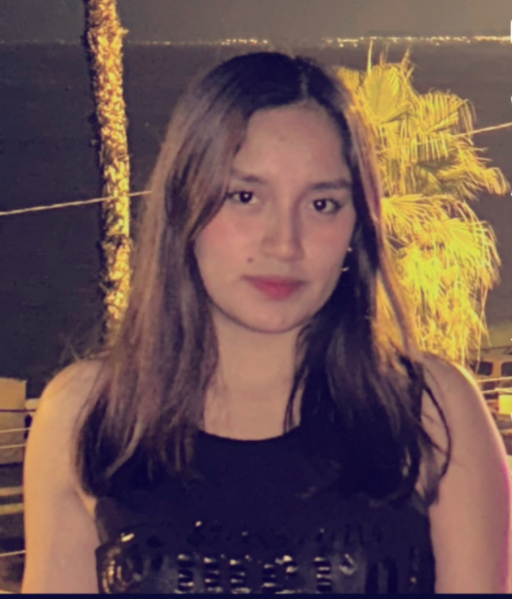
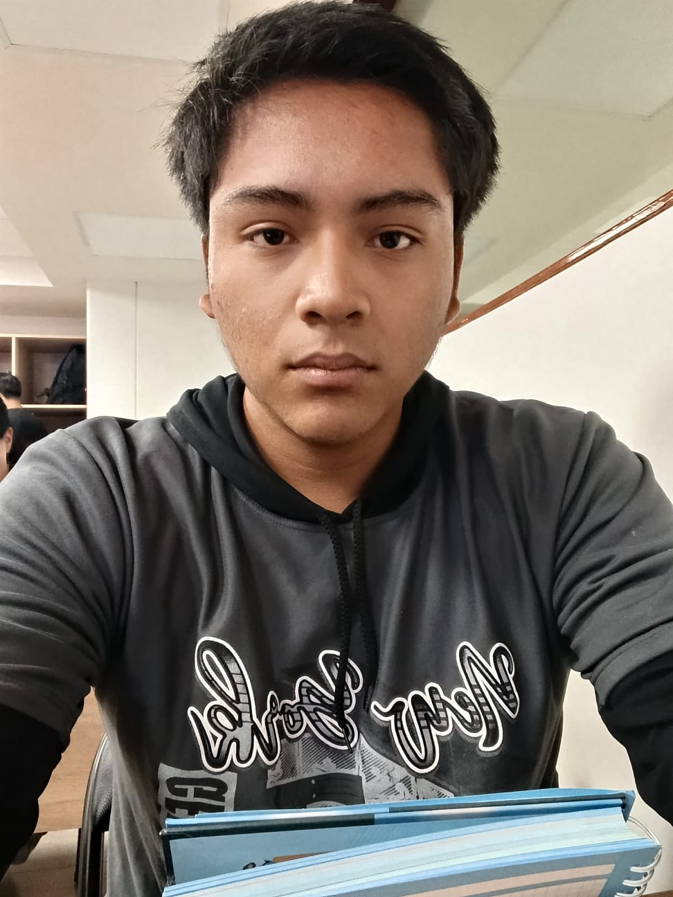

<div align="center">
  
  
  
  <br><br>

  <h1>🚀 Equipo 01 — Proyecto Prueba</h1>
  <p><b>Carreras de Ingeniería Informática e Industrial</b><br>
  <i>Universidad Peruana Cayetano Heredia (UPCH) • 2026-2</i></p>

  <p align="center">
    <a href="#"></a>
    <a href="#"></a>
    <a href="#"></a>
    <a href="#"></a>
  </p>


</div>

---

## 📋 Tabla de Contenidos
* [🌍 Descripción del Equipo y Misión](#-descripción-del-equipo-y-misión)
* [🎯 Alineación con los ODS](#-alineación-con-los-ods-agenda-2030)
* [👥 Equipo Multidisciplinario y Contacto](#-equipo-multidisciplinario-y-contacto)
* [🔄 Metodología de Trabajo](#-metodología-de-trabajo)
* [📁 Estructura del Repositorio](#-estructura-del-repositorio)

---

## 🌍 Descripción del Equipo y Misión

> 💡 **Idea de Proyecto Innovador (Propuesta):** *Desarrollo de un sistema IoT modular de bajo costo asistido por IA para la detección temprana de contaminantes biológicos en fuentes de agua comunales.* El proyecto busca empoderar a comunidades periurbanas mediante sensores accesibles que alertan en tiempo real sobre la potabilidad del agua, optimizando la respuesta sanitaria antes de que ocurran brotes de enfermedades.

Somos el **Equipo 01** del curso **Procesos de Innovación en Ingeniería**. Estamos conformados por estudiantes de Ingeniería Informática e Industrial de la **Universidad Peruana Cayetano Heredia**. Como equipo que recién inicia su camino, buscamos fusionar la optimización de procesos logísticos con el desarrollo de software avanzado para diseñar una solución tecnológica que sea viable, escalable y con un alto impacto social en nuestra comunidad.

---

## 🎯 Alineación con los ODS (Agenda 2030)

Nuestra propuesta preliminar se alinea de manera directa con los siguientes Objetivos de Desarrollo Sostenible:

| ODS | Meta Clave | Aplicación Tentativa en el Proyecto | Impacto Esperado |
| :---: | :---: | :---: | :---: |
| **ODS 6:** Agua Limpia y Saneamiento | **Meta 6.1:** Lograr el acceso universal y equitativo al agua potable a un precio accesible. | Monitoreo automatizado de la calidad hídrica con sensores de código abierto. | 💧 **Agua Segura** |
| **ODS 11:** Ciudades y Comunidades Sostenibles | **Meta 11.b:** Reducir significativamente la vulnerabilidad de asentamientos humanos marginados. | Infraestructura resiliente y conectada para alertar riesgos de salud ambiental en tiempo real. | 🏙️ **Comunidad Resiliente** |

---

## 👥 Nuestro Equipo y Contacto

💡 **Enfoque colaborativo:** *Combinamos habilidades técnicas y de gestión para estructurar el proyecto.*

| Foto | Nombre | Rol Principal | Responsabilidades | Correo |
| :---: | :--- | :---: | :--- | :--- |
|  | **Carpio Huaranga, Jurgen** | 🎯 Líder | Gestión y toma de decisiones. | `jurgen.carpio@upch.pe` |
|  | **Mendez Pecho, Xiomara** | 🔬 Investigación | Análisis de datos y métricas. | `xiomara.mendez@upch.pe` |
|  | **Cordova Asencio, Xiomi** | 🎨 Diseñadora | Prototipos y experiencia de usuario. | `xiomi.cordova@upch.pe` |
|  | **Taipe Condori, Jherson** | 📝 Documentación | Redacción técnica y actas. | `Wilder.taipe@upch.com` |
|  | **Briceño More, Yen** | 💻 Programador | Desarrollo y IA. | `yen.briceno@upch.pe` |


---

## 🔄 Metodología de Trabajo

Aplicaremos el marco de **Design Thinking** adaptado al desarrollo ágil, iniciando desde las fases de empatía profunda:

- [ ] **1. Empatizar:** Investigación cualitativa y mapeo de dolores del usuario final.
- [ ] **2. Definir:** Delimitación de requerimientos técnicos e hipótesis de diseño.
- [ ] **3. Idear:** Lluvia de ideas de hardware/software y matrices de selección.
- [ ] **4. Prototipar:** Ensamble físico preliminar y desarrollo de interfaces básicas.
- [ ] **5. Testear:** Pruebas controladas de laboratorio y validación con usuarios.

---

## 📁 Estructura del Repositorio

Siguiendo las pautas de inicio de la práctica para un repositorio ordenado y limpio:

```text
📁 Proyecto_Prueba/
│
├── 📁 Documentación/     # Informes técnicos, actas de reunión y entregables iniciales
└── 📄 README.md          # Presentación general del equipo y proyecto (Este archivo)
```

---
<p align="center">
  <sub>Estructura inicial desarrollada por el <b>Equipo 01</b> • UPCH © 2026</sub>
</p>
