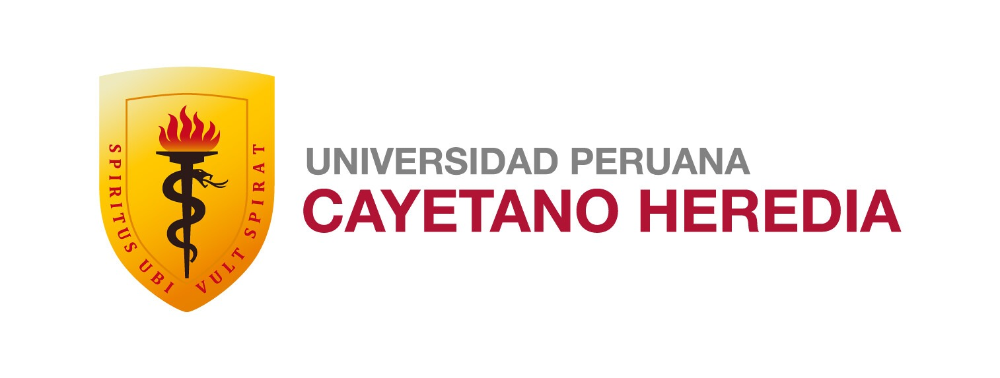
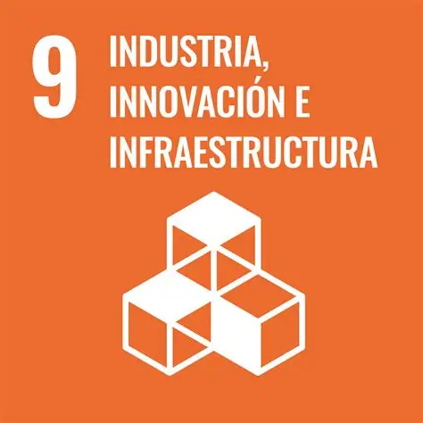
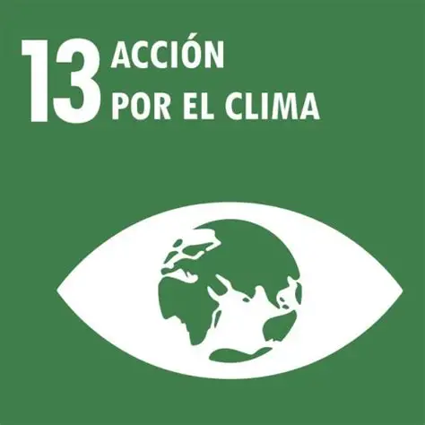
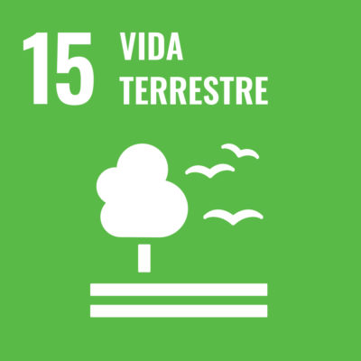
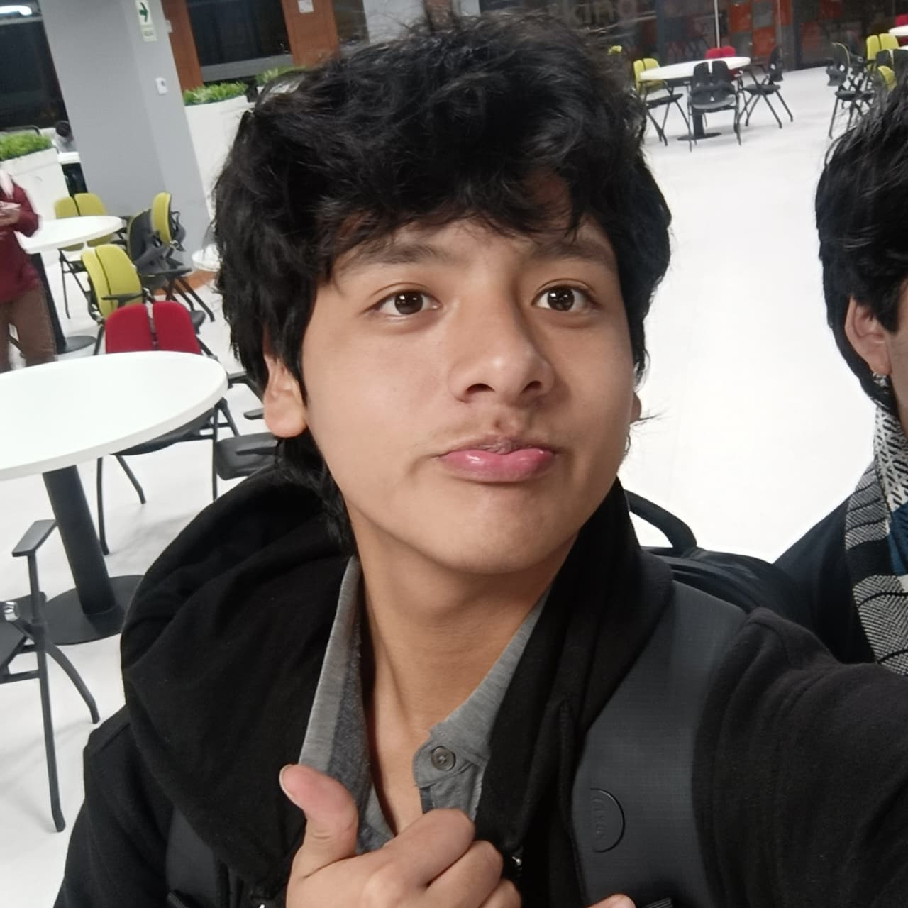
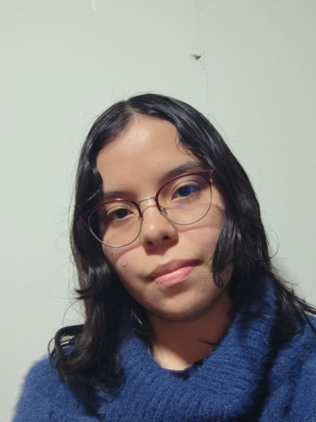
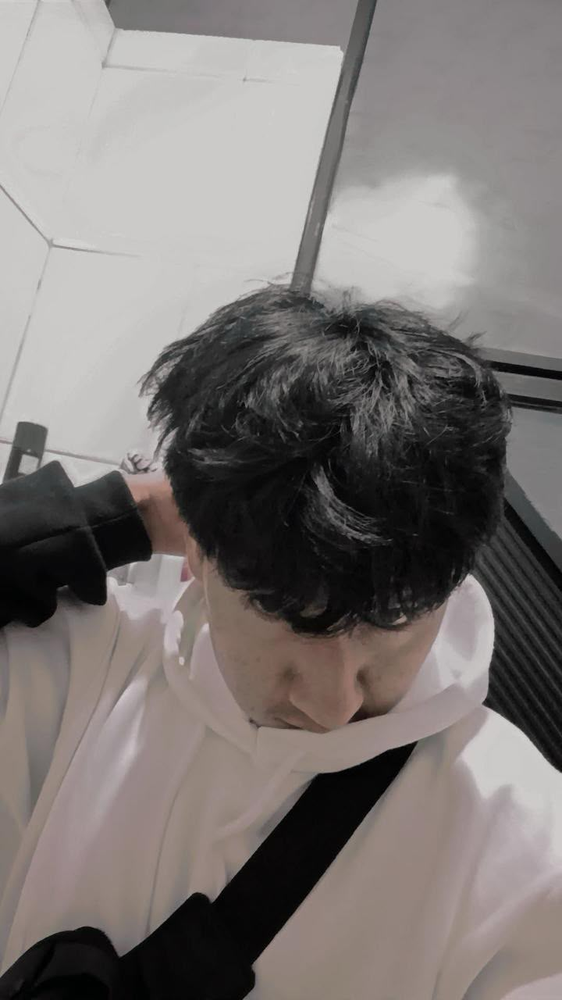

<div align="center">
  
  
  
  <br><br>

  <h1>🚀 Equipo 01 — Procesos de Innovacion Proyecto 1</h1>
  <p><b>Carreras de Ingeniería Informática, Ambiental e Industrial</b><br>
  <i>Universidad Peruana Cayetano Heredia (UPCH) • 2026-2</i></p>

  <p align="center">
    <a href="#"></a>
    <a href="#"></a>
    <a href="#"></a>
    <a href="#"></a>
  </p>

</div>

---

## 📋 Tabla de Contenidos
- [🎯 Descripción del Equipo y Objetivo](#-descripción-del-equipo-y-objetivo)
- [🌍 Impacto y ODS](#-impacto-y-ods)
- [👥 Equipo Multidisciplinario](#-equipo-multidisciplinario)
- [🚀 Stack Tecnológico](#-stack-tecnológico)
- [📁 Estructura del Repositorio](#-estructura-del-repositorio)

---

## 🎯 Descripción del Equipo y Objetivo

**Sobre Nosotros (Equipo 01):**  
Somos un equipo multidisciplinario de estudiantes enfocados en la creación de soluciones tecnológicas que generen un impacto real y positivo en la sociedad. Combinamos conocimientos en investigación, diseño, desarrollo de software y gestión para construir herramientas accesibles y eficientes.

**Nuestro Objetivo:**  
Desarrollar e implementar **WILLAY** (del quechua *"Aviso/Alerta"*), un sistema DeepTech de inteligencia climática diseñado para predecir eventos meteorológicos extremos, como heladas y sequías, con alta precisión. Buscamos brindar alertas tempranas hiperlocales para salvaguardar los cultivos y mejorar la resiliencia de los pequeños agricultores andinos frente al cambio climático.

---

## 🌍 Impacto y ODS

Nuestro proyecto está alineado con 3 Objetivos de Desarrollo Sostenible (ODS) principales que abarcan la innovación, la tecnología y el cuidado ambiental:

| ODS | Enfoque | Contribución del Proyecto |
|:---:|:---:|---|
|  | **Innovación y Tecnología** | Desarrollo de infraestructura tecnológica (Redes neuronales BiLSTM y análisis satelital) adaptada para zonas rurales y de baja conectividad. |
|  | **Cuidado Ambiental** | Creación de una herramienta directa de adaptación y mitigación ante los efectos del cambio climático en la agricultura de los Andes. |
|  | **Cuidado Ambiental** | Promoción de prácticas agrícolas sostenibles al optimizar recursos y prevenir la degradación de las tierras de cultivo por fenómenos extremos. |

---

## 👥 Equipo Multidisciplinario

| Foto | Nombre | Rol Principal | Responsabilidades Clave |
|:---:|--------|--------------|-------------------------|
|  | **Carpio Huaranga, Jurgen Adriano** | 🎯 Líder del equipo | Gestión del proyecto, coordinación general, toma de decisiones y seguimiento de objetivos. |
|  | **Mendez Pecho, Xiomara Valentina** | 🔬 Responsable de investigación | Análisis de datos climáticos, validación científica, investigación bibliográfica y métricas de impacto. |
|  | **Cordova Asencio, Xiomi** | 🎨 Diseñador/a | Diseño UX/UI, creación de prototipos interactivos, experiencia de usuario y accesibilidad de la plataforma. |
|  | **Taipe Condori, Wilder Jherson** | 📝 Encargado/a de documentación | Redacción técnica, elaboración de manuales, actas de reuniones y estructuración del repositorio. |
|  | **Briceño More, Yen Yosue** | 💻 Programador/a - Modelador/a | Desarrollo del código (frontend/backend), implementación de modelos de IA y arquitectura de software. |

---

## 🚀 Stack Tecnológico

### 🖥️ Entorno Web y Móvil
- **Frontend:** React + TypeScript (Vite)
- **Estilos:** Tailwind CSS + shadcn/ui
- **Offline:** Progressive Web App (PWA) para modo sin conexión

### ⚙️ Lógica y Modelado (IA)
- **Backend:** Python + FastAPI
- **Modelos:** TensorFlow / PyTorch (Redes BiLSTM)
- **Base de datos:** Firebase / Supabase

### 🛰️ Orígenes de Datos
- **Procesamiento Satelital:** Google Earth Engine API
- **Datos:** Sentinel-1, Sentinel-2 y datos meteorológicos de SENAMHI

---

## 📁 Estructura del Repositorio

```text
grupo01/
├── documentación/  # Manuales, actas, arquitectura y documentación del sistema
├── hardware/       # Código para microcontroladores y sensores en campo (IoT)
├── imagenes/       # Recursos gráficos, logotipos y fotografías del equipo
├── software/       # Desarrollo del código fuente (frontend, backend y modelos de IA)
└── README.md       # Presentación general del proyecto